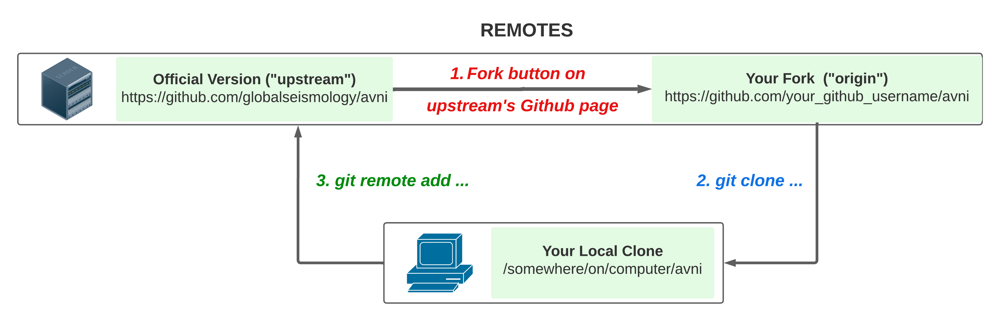

.. _contributing:

Contributing guide
==================

.. include:: ../links.inc
.. highlight:: console

.. note:: If you do not already have one, you will need to open a free account
   on `github`_. You might also need to create an account on our `Web
   site <http://globalseismology.org/register>`__ for API access.
   Please feel free to reaching out to us at `avni@globalseismology.org`_.

Thanks for taking the time to contribute! AVNI is an open-source project
sustained mostly by volunteer effort. We welcome contributions from anyone as
long as they abide by our `Code of Conduct`_.

There are several ways to contribute:

.. rst-class:: icon-bullets

- |computer-mouse| Use the software, and when you find bugs, tell us about them!
- |bug-slash| Fix bugs on your own.
- |comment| Tell `AVNI Forum`_ about parts of the documentation that you find confusing or
  unclear.
- |hand-sparkles| Tell `AVNI Forum`_ about things you wish AVNI could do.
- |discourse| Answer questions on the `AVNI Forum`_.
- |text-slash| Fix mistakes or add notes in our function documentation strings.
- |pencil| Improve existing tutorials or write new ones.
- |wand-magic-sparkles| Implement new features.

In order to *report* bugs, *request* new features, or *ask about* confusing
documentation, it's best to open a new issue on the `AVNI Forum`_.
You will get help fastest that way, and it helps keep our `GitHub issues page`_
focused on things that we *know* will require changes to our
software (as opposed to problems that can be fixed in the user's code). We may
ultimately ask you to open an issue on the `GitHub issues page`_ too, but starting on the forum
helps us keep things organized. For fastest results, be sure to include
information about your operating system and AVNI version, and (if
applicable) include a reproducible code sample that is as short as possible.

If you want to *fix* bugs, *add* new features, or *improve* our
docstrings/tutorials/website, those kinds of contributions are made through
`our GitHub repository <AVNI GitHub_>`_. The rest of this page explains
how to set up your workflow to make contributing via GitHub seamless.


.. dropdown:: Want an example to work through?
    :color: success
    :icon: rocket

    Feel free to just read through the rest of the page, but if you find it
    easier to "learn by doing", take a look at our
    `GitHub issues marked "easy"`_, pick one that looks interesting, and work
    through it while reading this guide!


Overview of the contribution process
^^^^^^^^^^^^^^^^^^^^^^^^^^^^^^^^^^^^

.. warning:: Reminder: all contributors are expected to follow our
          `code of conduct`_.

Changes to AVNI are typically made by `forking`_ the `AVNI GitHub`_
repository, making changes to your fork (usually by `cloning`_ it to your
personal computer, making the changes locally, and then `pushing`_ the local
changes up to your fork on GitHub), and finally creating a `pull request`_ to incorporate
your changes back into the shared "upstream" version of the codebase.

In general you'll be working with three different copies of the AVNI
codebase: the official remote copy at https://github.com/globalseismology/avni
(usually called ``upstream``), your remote `fork`_ of the upstream repository
(similar URL, but with your username in place of ``globalseismology``, and usually
called ``origin``), and the local copy of the codebase on your computer. The
typical contribution process is to:

1. synchronize your local copy with ``upstream``

2. make changes to your local copy

3. `push`_ your changes to ``origin`` (your remote fork of the upstream)

4. submit a `pull request`_ from your fork into ``upstream``

The sections :ref:`basic-git` and :ref:`github-workflow` (below) describe this
process in more detail.


Setting up your local development environment
^^^^^^^^^^^^^^^^^^^^^^^^^^^^^^^^^^^^^^^^^^^^^

Configuring git
~~~~~~~~~~~~~~~

.. note::
    :class: sidebar

    `GitHub desktop`_ is a GUI alternative to command line git that some users
    appreciate; it is available for |windows| Windows and |apple| MacOS.

To get set up for contributing, make sure you have git installed on your local
computer:

- On Linux, the command ``sudo apt install git`` is usually sufficient; see the
  `official Linux instructions`_ for more options.

- On MacOS, download `the .dmg installer`_; Atlassian also provides `more
  detailed instructions and alternatives`_ such as using MacPorts or Homebrew.

- On Windows, download and install `git for Windows`_. With Git BASH it provides its own shell that
  includes many Linux-equivalent command line programs that are useful for development.

  *Windows 10 also offers the* `Windows subsystem for Linux`_ *that offers similar
  functionality to git BASH, but has not been widely tested by AVNI
  developers yet and may still pose problems with graphical output (e.g. building the documentation)*


Once git is installed, the only absolutely necessary configuration step is
identifying yourself and your contact info::

   $ git config --global user.name "Your Name"
   $ git config --global user.email you@yourdomain.example.com

Make sure that the same email address is associated with your GitHub account
and with your local git configuration. It is possible to associate multiple
emails with a GitHub account, so if you initially set them up with different
emails, you can add the local email to the GitHub account.

Sooner or later, git is going to ask you what text editor you want it to use
when writing commit messages, so you might as well configure that now too::

   $ git config --global core.editor vim    # or vim, or nano, or subl, or...

There are many other ways to customize git's behavior; see `configuring git`_
for more information.

Forking the AVNI repository
~~~~~~~~~~~~~~~~~~~~~~~~~~~~~~~~~

Once you have git installed and configured, and before creating your local copy
of the codebase, go to the `AVNI GitHub`_ page and create a `fork`_ into
your GitHub user account.

.. image:: https://docs.github.com/assets/cb-28613/images/help/repository/fork_button.png

This will create a copy of the AVNI codebase inside your GitHub user
account (this is called "your fork"). Changes you make to AVNI will
eventually get "pushed" to your fork, and will be incorporated into the
official version of AVNI (often called the "upstream version") through a
"pull request". This process will be described in detail below; a summary
of how that structure is set up is given here:




Creating the virtual environment
~~~~~~~~~~~~~~~~~~~~~~~~~~~~~~~~

.. note:: Supported Python environments
    :class: sidebar

    We strongly recommend the `Anaconda`_ or `Miniconda`_ environment managers
    for Python. Other setups are possible but are not officially supported by
    the AVNI development team; see discussion :ref:`here
    <other-py-distros>`. These instructions use  ``conda`` where possible;
    experts may replace those lines with some combination of ``git`` and
    ``pip``.

These instructions will set up a Python environment that is separated from your
system-level Python and any other managed Python environments on your computer.
This lets you switch between different versions of Python (AVNI version |version|
requires Python version |min_python_version| or higher) and also switch between
the stable and development versions of AVNI (so you can, for example, use the same computer to
analyze your data with the stable release, and also work with the latest
development version to fix bugs or add new features). Even if you've already
followed the :ref:`installation instructions <install-python>` for the stable
version of AVNI, you should now repeat that process to create a new,
separate environment for AVNI development (here we'll give it the name
``avni-dev``)::

    $ curl --remote-name https://raw.githubusercontent.com/globalseismology/avni/main/environment.yml
    $ conda env create --file environment.yml --name avni-dev
    $ conda activate avni-dev

Now you'll have *two* AVNI environments: ``avni`` (or whatever custom
name you used when installing the stable version of AVNI) and ``avni-dev``
that we just created. At this point ``avni-dev`` also has the stable version of
AVNI (that's what the :file:`environment.yml` file installs), but we're
about to remove the stable version from ``avni-dev`` and replace it with the
development version. To do that, we'll `clone`_ the AVNI repository from
your remote fork, and also connect the local copy to the ``upstream`` version
of the codebase, so you can stay up-to-date with changes from other
contributors. First, edit these two variables for your situation::

    $ GITHUB_USERNAME="insert_your_actual_GitHub_username_here"
    $ # pick where to put your local copy of AVNI development version:
    $ INSTALL_LOCATION="/opt"

.. note::
   On Windows, add ``set`` before the variable names (``set GITHUB_USERNAME=...``, etc.).

Then make a local clone of your remote fork (``origin``)::

    $ cd $INSTALL_LOCATION
    $ git clone https://github.com/$GITHUB_USERNAME/AVNI.git

Finally, set up a link between your local clone and the official repository
(``upstream``)::

    $ cd AVNI
    $ git remote add upstream https://github.com/globalseismology/avni.git
    $ git fetch --all

Now we'll remove the *stable* version of AVNI and replace it with the
*development* version (the clone we just created with git). Make sure you're in
the correct environment first (``conda activate avni-dev``), and then do::

    $ cd $INSTALL_LOCATION/AVNI    # make sure we're in the right folder
    $ conda remove --force avni  # the --force avoids dependency checking
    $ pip install -e .

The command ``pip install -e .`` installs a python module into the current
environment by creating a link to the source code directory (instead of copying
the code to pip's :file:`site_packages` directory, which is what normally
happens). This means that any edits you make to the AVNI source code will
be reflected the next time you open a Python interpreter and ``import avni``
(the ``-e`` flag of ``pip`` stands for an "editable" installation).

Finally, we'll add a few dependencies that are not needed for running
AVNI, but are needed for locally running our test suite::

    $ pip install -r requirements_testing.txt

And for building our documentation::

    $ pip install -r requirements_doc.txt
    $ conda install graphviz

.. note::
   On Windows, if you installed graphviz using the conda command above but still get an error like this::

      WARNING: dot command 'dot' cannot be run (needed for graphviz output), check the graphviz_dot setting

   try adding the graphviz folder to path::

      $ PATH=$CONDA_PREFIX\\Library\\bin\\graphviz:$PATH

To build documentation, you will also require `optipng`_:

- On Linux, use the command ``sudo apt install optipng``.

- On MacOS, optipng can be installed using Homebrew.

- On Windows, unzip :file:`optipng.exe` from the `optipng for Windows`_ archive
  into the :file:`doc/` folder. This step is optional for Windows users.

You can also choose to install some optional linters for reStructuredText::

    $ conda install -c conda-forge sphinx-autobuild doc8


.. _basic-git:

Basic git commands
~~~~~~~~~~~~~~~~~~

Learning to work with git can take a long time, because it is a complex and
powerful tool for managing versions of files across multiple users, each of
whom have multiple copies of the codebase. We've already seen in the setup
commands above a few of the basic git commands useful to an AVNI
developer:

- :samp:`git clone {<URL_OF_REMOTE_REPO>}` (make a local copy of a repository)

- :samp:`git remote add {<NICKNAME_OF_REMOTE>} {<URL_OF_REMOTE_REPO>}` (connect
  a local copy to an additional remote)

- ``git fetch --all`` (get the current state of connected remote repos)

Other commands that you will undoubtedly need relate to `branches`_. Branches
represent multiple copies of the codebase *within a local clone or remote
repo*. Branches are typically used to experiment with new features while still
keeping a clean, working copy of the original codebase that you can switch back
to at any time. The default branch of any repo is called ``main``, and
it is recommended that you reserve the ``main`` branch to be that clean copy
of the working ``upstream`` codebase. Therefore, if you want to add a new
feature, you should first synchronize your local ``main`` branch with the
``upstream`` repository, then create a new branch based off of ``main`` and
`check it out`_ so that any changes you make will exist on that new branch
(instead of on ``main``)::

    $ git checkout main            # switch to local main branch
    $ git fetch upstream             # get the current state of the remote upstream repo
    $ git merge upstream/main      # synchronize local main branch with remote upstream main branch
    $ git checkout -b new-feature-x  # create local branch "new-feature-x" and check it out

.. note:: Alternative
    :class: sidebar

    You can save some typing by using ``git pull upstream/main`` to replace
    the ``fetch`` and ``merge`` lines above.

Now that you're on a new branch, you can fix a bug or add a new feature, add a
test, update the documentation, etc. When you're done, it's time to organize
your changes into a series of `commits`_. Commits are like snapshots of the
repository — actually, more like a description of what has to change to get
from the most recent snapshot to the current snapshot.

Git knows that people often work on multiple changes in multiple files all at
once, but that ultimately they should separate those changes into sets of
related changes that are grouped together based on common goals (so that it's
easier for their colleagues to understand and review the changes). For example,
you might want to group all the code changes together in one commit, put new
unit tests in another commit, and changes to the documentation in a third
commit.  Git makes this possible with something called the `stage`_ (or
*staging area*). After you've made some changes to the codebase, you'll have
what git calls "unstaged changes", which will show up with the `status`_
command::

    $ git status    # see what state the local copy of the codebase is in

Those unstaged changes can be `added`_ to the stage one by one, by either
adding a whole file's worth of changes, or by adding only certain lines
interactively::

    $ git add avni/some_file.py      # add all the changes you made to this file
    $ git add avni/some_new_file.py  # add a completely new file in its entirety
    $ # enter interactive staging mode, to add only portions of a file:
    $ git add -p avni/viz/some_other_file.py

Once you've collected all the related changes together on the stage, the ``git
status`` command will now refer to them as "changes staged for commit". You can
commit them to the current branch with the `commit`_ command. If you just type
``git commit`` by itself, git will open the text editor you configured it to
use so that you can write a *commit message* — a short description of the
changes you've grouped together in this commit. You can bypass the text editor
by passing a commit message on the command line with the ``-m`` flag. For
example, if your first commit adds a new feature, your commit message might be::

    $ git commit -m 'ENH: adds feature X to the Epochs class'

Once you've made the commit, the stage is now empty, and you can repeat the
cycle, adding the unit tests and documentation changes::

    $ git add avni/tests/some_testing_file.py
    $ git commit -m 'add test of new feature X of the Epochs class'
    $ git add -p avni/some_file.py avni/viz/some_other_file.py
    $ git commit -m 'DOC: update Epochs and BaseEpochs docstrings'
    $ git add tutorials/new_tutorial_file.py
    $ git commit -m 'DOC: adds new tutorial about feature X'

When you're done, it's time to run the test suite to make sure your changes
haven't broken any existing functionality, and to make sure your new test
covers the lines of code you've added (see :ref:`run-tests` and
:ref:`build-docs`, below). Once everything looks good, it's time to push your
changes to your fork::

    $ # push local changes to remote branch origin/new-feature-x
    $ # (this will create the remote branch if it doesn't already exist)
    $ git push origin new-feature-x

Finally, go to the `AVNI GitHub`_ page, click on the pull requests tab,
click the "new pull request" button, and choose "compare across forks" to
select your new branch (``new-feature-x``) as the "head repository".  See the
GitHub help page on `creating a PR from a fork`_ for more information about
opening pull requests.

If any of the tests failed before you pushed your changes, try to fix them,
then add and commit the changes that fixed the tests, and push to your fork. If
you're stuck and can't figure out how to fix the tests, go ahead and push your
commits to your fork anyway and open a pull request (as described above), then
in the pull request you should describe how the tests are failing and ask for
advice about how to fix them.

To learn more about git, check out the `GitHub help`_ website, the `GitHub
skills`_ tutorial series, and the `pro git book`_.

Regular daily git usage
~~~~~~~~~~~~~~~~~~~~~~~

A typical workflow on a given workda involves the following steps in sequence on
your local machine:

-  update your copy of the repository::

       $ git pull

-  if you get conflicts when doing so (i.e. if local changes you have
   made conflict with changes made by others on the same line of the
   same file of the source code), a powerful way of resolving them is to
   type this: (*meld* needs to be installed on your system; if it is
   not, you can install it with *apt-get install meld* or similar)::

       $ git mergetool --tool=meld

-  make some changes to any file you want using your favorite editor (in
   the line below we use ``vi`` as an example)::

       $ vim some_file.f90

-  commit your changes locally, adding a very short message (one line)
   explaining what you have changed; it is recommended to do a git pull
   right before that in order to make sure that your local copy is
   up-to-date::

       $ git pull ; git commit -a -m "Explain your commit"

-  if you get conflicts when committing your changes (i.e. if your
   changes conflict with changes made by others on the same line of the
   same file of the source code), a powerful way of resolving them is to
   type this: (`meld <http://meldmerge.org>`__ needs to be installed on
   your system; if it is not, you can install it with *yum install meld*
   in Linux, download MacOS version from `this webpage <https://yousseb.github.io/meld>`__.
   )::

       $ git mergetool --tool=meld

-  (optional) if you want to check what has changed (and thus what will
   be committed) before typing the ``git commit`` above, you can type
   one or both of these two commands::

       $ git status -s
       $ git diff

-  push your changes to your GitHub fork; it is recommended to do a git
   pull right before that in order to make sure that your local copy is
   up-to-date::

       $ git pull ; git push

-  Create a pull-request to get your changes into the main repository
   (this is needed only once for each change; if you are fixing an
   existing change after receiving an error message from our BuildBot
   code-consistency checking system, you need the "git push" above again
   but you do NOT need to create a pull request a second time); it is
   recommended to do a git pull right before that in order to make sure
   that your local copy is up-to-date::

       $ git pull ; git pull-request

*Note (optional):* It is not strictly necessary to create a pull request
for *every* commit you make if you do not want to, you can safely submit
pull requests after making a few commits instead if you prefer. However,
it also does not hurt to do so.


.. _github-ssh:

Connecting to GitHub with SSH (optional)
~~~~~~~~~~~~~~~~~~~~~~~~~~~~~~~~~~~~~~~~

One easy way to speed up development is to reduce the number of times you have
to type your password. SSH (secure shell) allows authentication with pre-shared
key pairs. The private half of your key pair is kept secret on your computer,
while the public half of your key pair is added to your GitHub account; when
you connect to GitHub from your computer, the local git client checks the
remote (public) key against your local (private) key, and grants access your
account only if the keys fit. GitHub has `several help pages`_ that guide you
through the process. As of the date of writing this document,

Once you have set up GitHub to use SSH authentication, you should change the
addresses of your AVNI GitHub remotes, from ``https://`` addresses to
``git@`` addresses, so that git knows to connect via SSH instead of HTTPS. For
example::

    $ git remote -v  # show existing remote addresses
    $ git remote set-url origin git@github.com:$GITHUB_USERNAME/avni.git
    $ git remote set-url upstream git@github.com:globalseismology/avni.git


AVNI coding conventions
^^^^^^^^^^^^^^^^^^^^^^^^^^^^^

General requirements
~~~~~~~~~~~~~~~~~~~~


All new functionality must be documented
----------------------------------------

This includes thorough docstring descriptions for all public API changes, as
well as how-to examples or longer tutorials for major contributions. Docstrings
for private functions may be more sparse, but should usually not be omitted.


Avoid API changes when possible
-------------------------------

Changes to the public API (e.g., class/function/method names and signatures)
should not be made lightly, as they can break existing user scripts.
Bug fixes (when something isn't doing what it says it will do) do
not require a deprecation cycle.

Note that any new API elements should be added to the main reference;
classes, functions, methods, and attributes cannot be cross-referenced unless
they are included in the :ref:`api_reference`
(:file:`doc/python_reference.rst`).


Describe your changes in the changelog
--------------------------------------

Include in your changeset a brief description of the change in the
:ref:`changelog <whats_new>` (:file:`doc/changes/latest.inc`; this can be
skipped for very minor changes like correcting typos in the documentation).

There are different sections of the changelog for each release, and separate
**subsections for bugfixes, new features, and changes to the public API.**
Please be sure to add your entry to the appropriate subsection.

The styling and positioning of the entry depends on whether you are a
first-time contributor or have been mentioned in the changelog before.

First-time contributors
"""""""""""""""""""""""

Welcome to AVNI! We're very happy to have you here. 🤗 And to ensure you
get proper credit for your work, please add a changelog entry with the
following pattern **at the top** of the respective subsection (bugs,
enhancements, etc.):

.. code-block:: rst


  Bugs
  ----

  - Short description of the changes (:gh:`0000` by :newcontrib:`Firstname Lastname`)

  - ...

where ``0000`` must be replaced with the respective GitHub pull request (PR)
number, and ``Firstname Lastname`` must be replaced with your full name.

It is usually best to wait to add a line to the changelog until your PR is
finalized, to avoid merge conflicts (since the changelog is updated with
almost every PR).

Lastly, make sure that your name is included in the list of authors in
:file:`doc/changes/names.inc`, otherwise the documentation build will fail.
To add an author name, append a line with the following pattern (note
how the syntax is different from that used in the changelog):

.. code-block:: rst

  .. _Your Name: https://www.your-website.com/

Many contributors opt to link to their GitHub profile that way. Have a look
at the existing entries in the file to get some inspiration.

Recurring contributors
""""""""""""""""""""""

The changelog entry should follow the following patterns:

.. code-block:: rst

    - Short description of the changes from one contributor (:gh:`0000` by `Contributor Name`_)
    - Short description of the changes from several contributors (:gh:`0000` by `Contributor Name`_, `Second Contributor`_, and `Third Contributor`_)

where ``0000`` must be replaced with the respective GitHub pull request (PR)
number. Mind the Oxford comma in the case of multiple contributors.

Sometimes, changes that shall appear as a single changelog entry are spread out
across multiple PRs. In this case, name all relevant PRs, separated by
commas:

.. code-block:: rst

    - Short description of the changes from one contributor in multiple PRs (:gh:`0000`, :gh:`1111` by `Contributor Name`_)
    - Short description of the changes from several contributors in multiple PRs (:gh:`0000`, :gh:`1111` by `Contributor Name`_, `Second Contributor`_, and `Third Contributor`_)

Test locally before opening pull requests (PRs)
-----------------------------------------------

AVNI uses `continuous integration`_ (CI) to ensure code quality and
test across multiple installation targets. However, the CIs are often slower
than testing locally, especially when other contributors also have open PRs
(which is basically always the case). Therefore, do not rely on the CIs to
catch bugs and style errors for you; :ref:`run the tests locally <run-tests>`
instead before opening a new PR and before each time you push additional
changes to an already-open PR.


Code style
~~~~~~~~~~

Adhere to standard Python style guidelines
------------------------------------------

All contributions to AVNI are checked against style guidelines described
in `PEP 8`_. We also check for common coding errors (such as variables that are
defined but never used). We allow very few exceptions to these guidelines, and
use tools such as pep8_, pyflakes_, and flake8_ to check code style
automatically.

When modifying an existing file, try to maintain consistency with its
original style. If the code you add looks drastically different from the
original code, it may be difficult for readers to follow. Try to avoid
this. Please give space for breathing by use 4 spaces instead of tabs:

good
```{code-block} python
dx = 0.5 \* fac \* (a - b)
```

bad
```{code-block} python
dx=1/2\ *fac*\ (a-b)
```

Use consistent variable naming
------------------------------

Classes should be named using ``CamelCase``. Functions and instances/variables
should use ``snake_case`` (``n_samples`` rather than ``nsamples``). Avoid
single-character variable names, unless inside a :term:`comprehension <list
comprehension>` or :ref:`generator <tut-generators>`.


We (mostly) follow NumPy style for docstrings
---------------------------------------------

In most cases you can look at existing AVNI docstrings to figure out how
yours should be formatted. If you can't find a relevant example, consult the
`Numpy docstring style guidelines`_ for examples of more complicated formatting
such as embedding example code, citing references, or including rendered
mathematics.

Note that we diverge from the NumPy docstring standard in a few
ways:

1. We use a module called ``sphinxcontrib-bibtex`` to render citations. Search
   our source code (``git grep footcite`` and ``git grep footbibliography``) to
   see examples of how to add in-text citations and formatted references to
   your docstrings, examples, or tutorials. The structured bibliographic data
   lives in :file:`doc/references.bib`; please follow the existing key scheme
   when adding new references (e.g., ``Singleauthor2019``,
   ``AuthoroneAuthortwo2020``, ``FirstauthorEtAl2021a``,
   ``FirstauthorEtAl2021b``).
2. We don't explicitly say "optional" for optional keyword parameters (because
   it's clear from the function or method signature which parameters have
   default values).
3. For parameters that may take multiple types, we use pipe characters instead
   of the word "or", like this: ``param_name : str | None``.
4. We don't include a ``Raises`` or ``Warns`` section describing
   errors/warnings that might occur.

Other style guidance
--------------------

- Guidelines for formatting in Fortran is provided

- Use single quotes whenever possible.

- Prefer :ref:`generators <tut-generators>` or
  :term:`comprehensions <list comprehension>` over :func:`filter`, :func:`map`
  and other functional idioms.

- Use explicit functional constructors for builtin containers to improve
  readability (e.g., :ref:`list() <func-list>`, :ref:`dict() <func-dict>`,
  :ref:`set() <func-set>`).

- Avoid nested functions or class methods if possible — use private functions
  instead.

- Avoid ``*args`` and ``**kwargs`` in function/method signatures.


Code organization
~~~~~~~~~~~~~~~~~

Importing
---------

Import modules in this order, preferably alphabetized within each subsection:

1. Python built-in (``copy``, ``functools``, ``os``, etc.)

2. NumPy (``numpy as np``) and, in test files, pytest (``pytest``)

3. AVNI imports (e.g., ``from .pick import pick_types``)

When importing from other parts of AVNI, use relative imports in the main
codebase and absolute imports in tests, tutorials, and how-to examples. Imports
for ``matplotlib``, ``scipy``, and optional modules (``sklearn``, ``pandas``,
etc.) should be nested (i.e., within a function or method, not at the top of a
file). This helps reduce import time and limit hard requirements for using MNE.


Return types
------------

Methods should modify inplace and return ``self``, functions should return
copies (where applicable). Docstrings should always give an informative name
for the return value, even if the function or method's return value is never
stored under that name in the code.


.. _build-docs:

Building the documentation
~~~~~~~~~~~~~~~~~~~~~~~~~~

Our documentation (including docstrings in code files) is in two formats that are built using Sphinx_:

1. reStructuredText_ format that is built using `Sphinx-Gallery`_
2. MyST_ format, a rich and extensible flavour of Markdown_ format, that is built using `myst_parser`_

The easiest way to ensure that your contributions to the documentation are
properly formatted is to follow the style guidelines on this page, imitate
existing documentation examples, refer to the Sphinx and Sphinx-Gallery
reference materials when unsure how to format your contributions, and build the
docs locally to confirm that everything looks correct before submitting the
changes in a pull request.

You can build the documentation locally using `GNU Make`_ with
:file:`doc/Makefile`. From within the :file:`doc` directory, you can test
formatting and linking by running::

    $ make html_dev-noplot

This will build the documentation *except* it will format (but not execute) the
tutorial and example files. If you have created or modified an example or
tutorial, you should instead run
:samp:`PATTERN={<REGEX_TO_SELECT_MY_TUTORIAL>} make html_dev-pattern` to render
all the documentation and additionally execute just your example or tutorial
(so you can make sure it runs successfully and generates the output / figures
you expect).

.. note::
   If you are using a *Windows command shell*, to use the pattern approach,
   use the following two lines:

   .. code-block:: doscon

      > set PATTERN=<REGEX_TO_SELECT_MY_TUTORIAL>
      > make html_dev-pattern

   If you are on Windows but using the `git BASH`_ shell, use the same two
   commands but replace ``set`` with ``export``.

After either of these commands completes, ``make show`` will open the
locally-rendered documentation site in your browser. If you see many warnings
that seem unrelated to your contributions, it might be that your output folder
for the documentation build contains old, now irrelevant, files. Running
``make clean`` will clean those up. Additional ``make`` recipes are available;
run ``make help`` from the :file:`doc` directory or consult the
`Sphinx-Gallery`_ documentation for additional details.

GitHub workflow
~~~~~~~~~~~~~~~

Nearly everyone in the community of AVNI contributors and maintainers is
a working scientist, engineer, or student who contributes to AVNI in
their spare time. For that reason, a set of best practices have been adopted to
streamline the collaboration and review process. Most of these practices are
common to many open-source software projects, so learning to follow them while
working on AVNI will bear fruit when you contribute to other projects
down the road. Here are the guidelines:

- Search the `GitHub issues page`_ (both open and closed issues) in case
  someone else has already started work on the same bugfix or feature. If you
  don't find anything, `open a new issue`_ to discuss changes with maintainers
  before starting work on your proposed changes.

- Implement only one new feature or bugfix per pull request (PR). Occasionally
  it may make sense to fix a few related bugs at once, but this makes PRs
  harder to review and test, so check with AVNI maintainers first before
  doing this. Avoid purely cosmetic changes to the code; they make PRs harder
  to review.

- It is usually better to make PRs *from* branches other than your main
  branch, so that you can use your main branch to easily get back to a
  working state of the code if needed (e.g., if you're working on multiple
  changes at once, or need to pull in recent changes from someone else to get
  your new feature to work properly).

- In most cases you should make PRs *into* the upstream's main branch, unless
  you are specifically asked by a maintainer to PR into another branch (e.g.,
  for backports or maintenance bugfixes to the current stable version).

- Don't forget to include in your PR a brief description of the change in the
  :ref:`changelog <whats_new>` (:file:`doc/whats_new.rst`).

- Our community uses the following commit tags and conventions:

  - Work-in-progress PRs should be created as `draft PRs`_ and the PR title
    should begin with ``WIP``.

  - When you believe a PR is ready to be reviewed and merged, `convert it
    from a draft PR to a normal PR`_, change its title to begin with ``MRG``,
    and add a comment to the PR asking for reviews (changing the title does not
    automatically notify maintainers).

  - PRs that only affect documentation should additionally be labelled
    ``DOC``, bugfixes should be labelled ``FIX``, and new features should be
    labelled ``ENH`` (for "enhancement"). ``STY`` is used for style changes
    (i.e., improving docstring consistency or formatting without changing its
    content).

  - the following commit tags are used to interact with our
    `continuous integration`_ (CI) providers. Use them judiciously; *do not
    skip tests simply because they are failing*:

    - ``[skip circle]`` Skip `CircleCI`_, which tests successful building of
      our documentation.

    - ``[skip actions]`` Skip our `GitHub Actions`_, which test installation
      and execution on Linux and macOS systems.

    - ``[skip azp]`` Skip `azure`_ which tests installation and execution on
      Windows systems.

    - ``[ci skip]`` is an alias for ``[skip actions][skip azp][skip circle]``.
      Notice that ``[skip ci]`` is not a valid tag.

    - ``[circle full]`` triggers a "full" documentation build, i.e., all code
      in tutorials and how-to examples will be *executed* (instead of just
      nicely formatted) and the resulting output and figures will be rendered
      as part of the tutorial/example.
