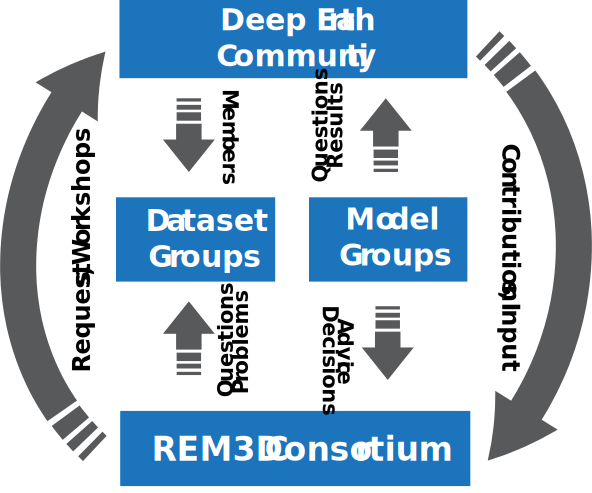

.. include:: ../links.inc
.. _governance:

==================
Project Governance
==================

The purpose of this document is to formalize the governance process used by the
AVNI project and to clarify how decisions are made and how the various elements
of our community interact.  This document elucidates the relationship between
open source collaborative development and work that may be funded by entities
that require private development.

The Project
===========

The AVNI software ecosystem (The Project) is designed to be an open source
software project. The goal of The Project is to develop open source software for
analysis of geoscience data in Python. The Project is released under the GNU GPL
v3 (or similar) `license <LICENSE_>`_, and is hosted publicly
under the ``globalseismology`` `GitHub organization <AVNI Github_>`_.

The Project is developed by a team of distributed developers, called
Contributors. Contributors are individuals who have contributed code,
documentation, designs, or other work to the Project. Anyone can be a
Contributor. Contributors can be affiliated with any legal entity or none.
Contributors participate in the project by submitting, reviewing, and discussing
GitHub Pull Requests and Issues and participating in open and public Project
discussions on GitHub and other channels. The foundation of Project
participation is openness and transparency.

The Project Community consists of all Contributors and Users of the Project.
Contributors work on behalf of and are responsible to the larger Project
Community and we strive to keep the barrier between Contributors and Users as
low as possible.

The Project is not a legal entity, nor does it currently have any formal
relationships with legal entities.

Community Effort
================

AVNI software ecosystem (The Project) is part of the wider community effort to
create a three-dimensional reference Earth model `REM3D <REM3D_>`_. The Project
aims to provide tools that reduce the barrier of entry for the adoption of
Earth models and datasets. A description of the REM3D project is provided in
:footcite:`MoulikEtAl2021,REM3D_AGU_2022`, and a complete list of relevant papers is provided
below:

.. footbibliography::

.. dropdown:: BibTeX for REM3D
    :color: info
    :icon: typography

    .. include:: ../references.bib
        :code: bibtex
        :start-after: % REM3D reference
        :end-before: % everything else

While AVNI is a distinct project from REM3D, the avenues of community
pariticipation are similar. In order to maximize the likelihood of success and
utility to the broader deep Earth community, the REM3D project receives input
from two advisory working groups, one focused on the reference dataset, and the
other on the reference model. Both working groups provide feedback and data to
the REM3D project theough various channels.

Governance model
================

This section describes the governance and leadership model of The Project.

The foundations of Project governance are:

-  openness and transparency
-  active contribution
-  institutional neutrality

Traditionally, Project leadership is provided by a subset of Contributors,
informally called Core Developers, whose active and consistent contributions
were rewarded by granting them “commit rights” to the Project GitHub
repositories. In general, all Project decisions are made through consensus among
the Core Developers with input from the Community.

Document history
================

https://github.com/globalseismology/avni/commits/main/docs/overview/governance.rst

License
=======

To the extent possible under law, the authors have waived all copyright and
related or neighboring rights to the AVNI project governance document, as per
the terms of our :doc:`license <../getting-started/cite>`.
